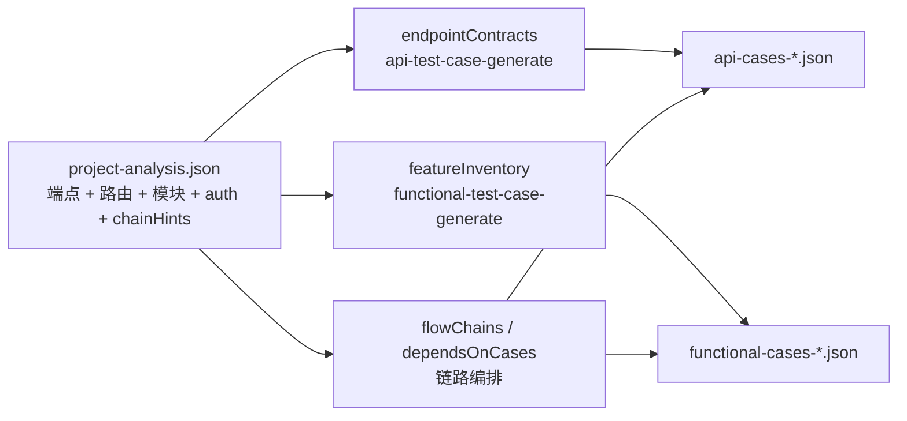

# 06 — 下游衔接

`project-analysis.json` 是**索引地图**；下游两个 generate 技能在此基础上**读源码**建立可测清单。

## 数据流



## 本技能应提供的「入口信息」

在 JSON 的 `downstream` 块（推荐）或分析摘要中写明：

```json
{
  "downstream": {
    "apiTestCaseGenerate": {
      "readPaths": [
        "backend/src/main/java/**/controller/*Controller.java",
        "backend/src/main/java/**/dto/*Dtos.java",
        "backend/src/main/java/**/common/GlobalExceptionHandler.java"
      ],
      "buildArtifact": "coverage.endpointContracts",
      "note": "requestBody 字段须从 DTO 核实；校验场景从 @Valid 注解推导"
    },
    "functionalTestCaseGenerate": {
      "readPaths": [
        "frontend/src/router/index.ts",
        "frontend/src/App.vue",
        "frontend/src/views/**/*.vue"
      ],
      "buildArtifact": "coverage.featureInventory + coverage.routeMenuMap",
      "note": "每路由打开 View 识别功能点；从布局组件提取侧栏 menuLabel 建立 routeMenuMap；步骤用 click_menu 而非 navigate 进入业务页"
    }
  }
}
```

路径按**实际仓库**填写，上述仅为 Spring + Vue 示例。

## chainHints（推荐，新增）

在 `project-analysis` 顶层补充可串联场景线索，帮助下游快速构建链路：

```json
{
  "chainHints": {
    "enabled": true,
    "candidateChains": [
      {
        "id": "CH-PROJECTS-LIFECYCLE",
        "module": "projects",
        "type": "resource-lifecycle",
        "producerEndpoints": ["POST /api/v1/projects"],
        "consumerEndpoints": ["GET /api/v1/projects/{id}", "PUT /api/v1/projects/{id}", "DELETE /api/v1/projects/{id}"],
        "suggestedVars": ["projectId"],
        "confidence": "high"
      }
    ],
    "crossModuleRefs": [
      { "fromModule": "projects", "toModule": "versions", "via": "projectId", "source": "path-param" }
    ]
  }
}
```

## 字段可信度分级

| 字段 | 本技能可信度 | 下游必须 |
|------|-------------|----------|
| `endpoints[].method/path` | 高 | 与 Controller 交叉验证 |
| `endpoints[].requiresAuth` | 中 | 读拦截器/Security 配置 |
| `endpoints[].requestBody` | 低（初步） | 读 DTO 得完整字段与校验 |
| `endpoints[].responseBody` | 低（初步） | 读 VO/统一响应包装 |
| `routes[].summary` | 中 | 打开页面组件细化 |
| `auth.type` | 高（若读过代码） | 读 token 签发与校验逻辑 |
| `chainHints` | 中 | 下游据此起草链路，再读源码确认 |

## scanLimitations（必写）

在 JSON 中记录本阶段**未做**的事，避免下游误把 analysis 当契约：

```json
{
  "scanLimitations": [
    "未解析 DTO 校验注解，requestBody 仅为 Controller 参数类型名",
    "未打开前端组件，routes.summary 为路由级概览",
    "未扫描 Service 层业务规则（如唯一键、状态机）"
  ]
}
```

## 分析完成后的对话摘要模板

```
✅ 项目分析完成（地图级，非最终契约）

- 📁 test-artifacts/project-analysis-{ts}.json
- 🔗 后端：{实际栈} → {baseUrl}
- 🎨 前端：{实际栈} → {baseUrl}
- 🔑 认证：{实际 type}；测试账号：{有/无}
- 📡 {N} 个端点 / {M} 个路由 / {K} 个模块
- 🔗 链路线索：{candidateChains 数量} 条（高置信：{high 数量}）
- ⚠️ 局限：{scanLimitations 首条}

后续（须读源码）：
  → 接口用例：对每个端点建 endpointContracts（见 api-test-case-generate/08）
  → 功能用例：对每个路由建 featureInventory（见 functional-test-case-generate/08）
```

## 禁止

- 把 `totalEndpoints` 当作接口用例条数目标
- 把 `routes.length` 当作功能用例条数目标
- 在未读 DTO 的情况下写「契约已完整覆盖」
