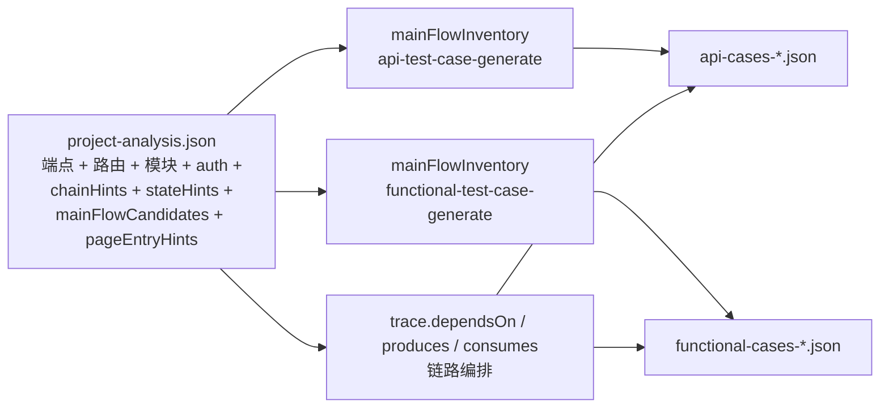

# 下游衔接

`project-analysis.json` 是**索引地图 + 主流程候选**；下游两个 generate 技能在此基础上**读源码**确认主流程并建立用例。

## 数据流



## 本技能应提供的「入口信息」

在 JSON 的 `downstream` 块中写明：

```json
{
  "downstream": {
    "apiTestCaseGenerate": {
      "readPaths": [
        "backend/src/main/java/**/controller/*Controller.java",
        "backend/src/main/java/**/dto/*Dtos.java",
        "backend/src/main/java/**/common/GlobalExceptionHandler.java"
      ],
      "buildArtifact": "coverage.mainFlowInventory",
      "mainFlowCandidates": true,
      "note": "确认 mainFlowCandidates + stateHints → mainFlowInventory；四维度交叉检查"
    },
    "functionalTestCaseGenerate": {
      "readPaths": [
        "frontend/src/router/index.ts",
        "frontend/src/App.vue",
        "frontend/src/views/**/*.vue"
      ],
      "buildArtifact": "coverage.mainFlowInventory + coverage.routeMenuMap",
      "pageEntryHints": true,
      "note": "确认 mainFlowCandidates + pageEntryHints → mainFlowInventory；菜单遍历法"
    }
  }
}
```

## 下游确认流程

API 侧：
1. 读 `mainFlowCandidates`：逐条确认/排除
2. 读 `stateHints[].transitions`：确认状态流转主流程
3. 读 `crossModuleRefs`：确认跨模块主流程
4. 读 Controller/DTO：补充 `evidence`、完善 `endpointSequence`
5. **四维度交叉检查**

功能侧：
1. 读 `mainFlowCandidates`：逐条确认/排除
2. 读 `pageEntryHints[].actions`：确认每个副作用操作是否有主流程
3. 读 View/Page 源码：补充 `evidence`、完善 `stepsSummary`
4. **菜单遍历法**兜底

## 摘要模板

分析完成后输出：

```
✅ 项目分析完成

📁 test-artifacts/project-analysis-{ts}.json
🔗 后端：{language} → {baseUrl}
🎨 前端：{framework} → {baseUrl}
🔑 认证：{auth.type}
📡 {totalEndpoints} 端点 / {totalRoutes} 路由 / {totalModules} 模块
🎯 {mainFlowCandidates.length} 个主流程候选
   - {stateHints.length} 个状态机
   - {crossModuleRefs.length} 个跨模块引用
⚠️ {scanLimitations[0]}

后续：
  → api-test-case-generate：确认候选 → 四维度检查 → 用例
  → functional-test-case-generate：确认候选 → 菜单遍历 → 用例
```
