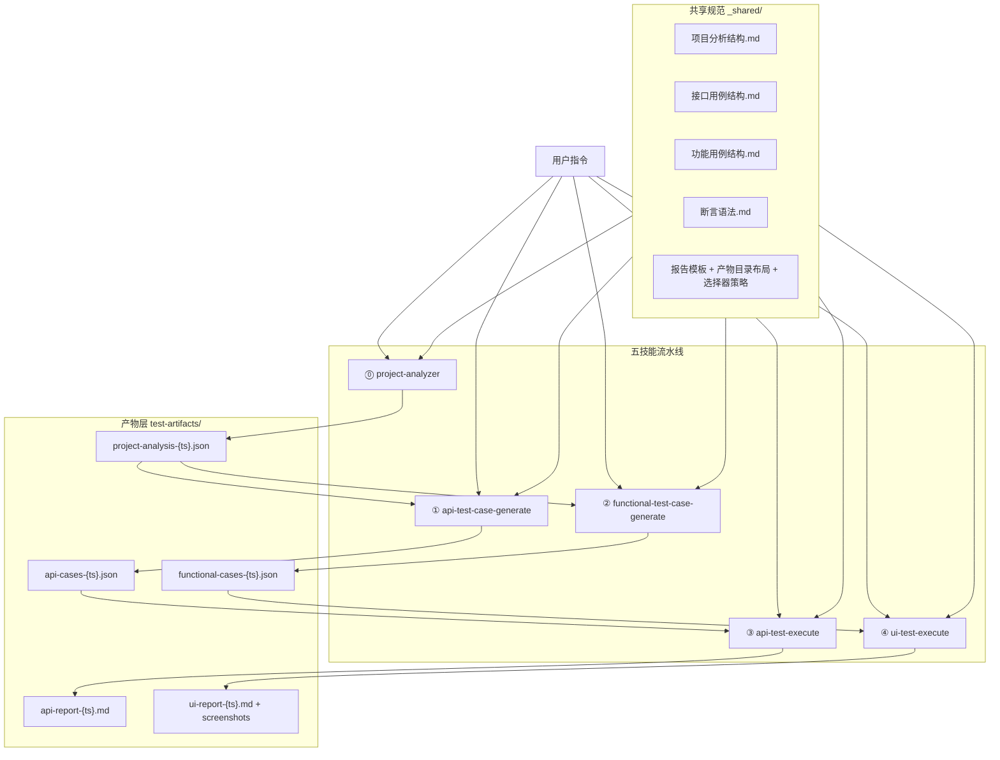
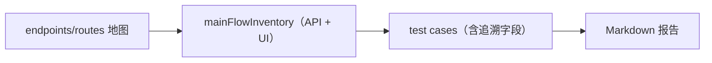

# AI 测试流水线 — 架构与流程

> 本文按仓库当前真实状态描述 `ai-test-pipeline` 的技能关系、数据流与产物流。  
> 验收以**覆盖率与链路完整性**为主，不以用例条数为 KPI。

---

## 一、总览架构



---

## 二、阶段划分

### 阶段 A：索引地图（project-analysis）

- 输入：后端入口（Controller/Router）、前端路由配置、认证配置
- 输出：`project-analysis-{ts}.json`
- 定位：提供端点/路由索引与链路线索（`chainHints`），不是最终契约真相

### 阶段 B：清单 + 用例生成

- API 侧：
  - 生成 `coverage.mainFlowInventory`（业务主流程清单）
  - 每条主流程 1～N 条 WF 用例（`flowRef` → `FLOW-*`）
  - 元信息 `mockData` 辅助外键/缺省字段
- 功能侧：
  - 生成 `coverage.mainFlowInventory`（业务主流程清单）
  - 每条主流程 1 条 WF 用例（`featureRefs` → `FLOW-*`）
- 双侧都要求链路字段可落地：
  - `dependsOnCases`、`produces`、`consumes`
  - UI 还可用 `steps.saveAs/useVar`

### 阶段 C：确定性执行 + Markdown 报告

- API 执行器：`scripts/run-api-tests.mjs`
  - 产物：`api-report-{ts}.md`
- UI 执行器：`scripts/run-functional-tests.mjs`
  - 产物：`ui-report-{ts}.md` + 截图

---

## 三、执行入口

- API：`node scripts/run-api-tests.mjs`
- UI：`node scripts/run-functional-tests.mjs`
- npm 快捷入口：`npm run test:api`、`npm run test:ui`

---

## 四、路径约定

```text
ai-test-pipeline/
├── scripts/                  # 执行脚本
├── test-artifacts/           # 全部产物根目录（运行时生成）
│   ├── api-cases/
│   ├── functional-cases/
│   ├── api-reports/
│   ├── ui-reports/
│   └── latest
└── _shared/                  # 结构与术语规范
```

约定：

- 默认从当前工作目录解析 `./test-artifacts`
- 可用 `--artifacts-dir <dir>` 覆盖
- 在包含 `test-artifacts/` 的目录执行脚本，**不要 `cd test-artifacts`**

---

## 五、追溯链（数据视角）



接口追溯：

- `flowRef` → `coverage.mainFlowInventory[]`（主流程 id，格式 `FLOW-*`）

功能追溯：

- `featureRefs` → `coverage.mainFlowInventory[]`（主流程 id，格式 `FLOW-*`）

链路追溯（双侧通用）：

- `dependsOnCases`
- `produces`
- `consumes`

---

## 六、验收口径（统一）

- API 主流程覆盖率 = 100%（`mainFlowCoveragePercent`）
- UI 主流程覆盖率 = 100%（`mainFlowCoveragePercent`）
- `orphanCases = 0`（流程用例需显式标注追溯）
- 链路可执行（依赖与变量消费可解析）
- 执行成功产出 Markdown 报告（含覆盖率统计与失败明细）

---

## 七、技能文档结构

各技能目录已统一为语义化文件名（详见 `README.md` §1.1）：

```text
project-analyzer/          api-test-case-generate/       functional-test-case-generate/
├── SKILL.md               ├── SKILL.md                  ├── SKILL.md
├── 工作流.md              ├── 主流程识别与设计.md        ├── 主流程识别与设计.md
├── 输出规范.md            ├── 工作流.md                 ├── 菜单导航与步骤.md
├── 多栈扫描指南.md        ├── 智能编排.md               ├── 工作流.md
├── 下游衔接.md            ├── 验收与输出.md             ├── 智能编排.md
└── 完整示例.md            └── 完整示例.md               ├── 验收与输出.md
                                                           └── 完整示例.md

api-test-execute/          ui-test-execute/
├── SKILL.md               ├── SKILL.md
├── 工作流.md              ├── 工作流.md
└── 结果判定与示例.md      ├── 浏览器配置.md
                           └── 结果判定与示例.md

_shared/目录.md            ← 共享规范索引
```

---

## 八、当前边界说明

- 本仓库按本地运行维护，不内置 CI 工作流。
- UI 执行依赖 Playwright（`package.json` 为 optionalDependencies）。
- 执行结果以 Markdown 报告为唯一对外交付物。
