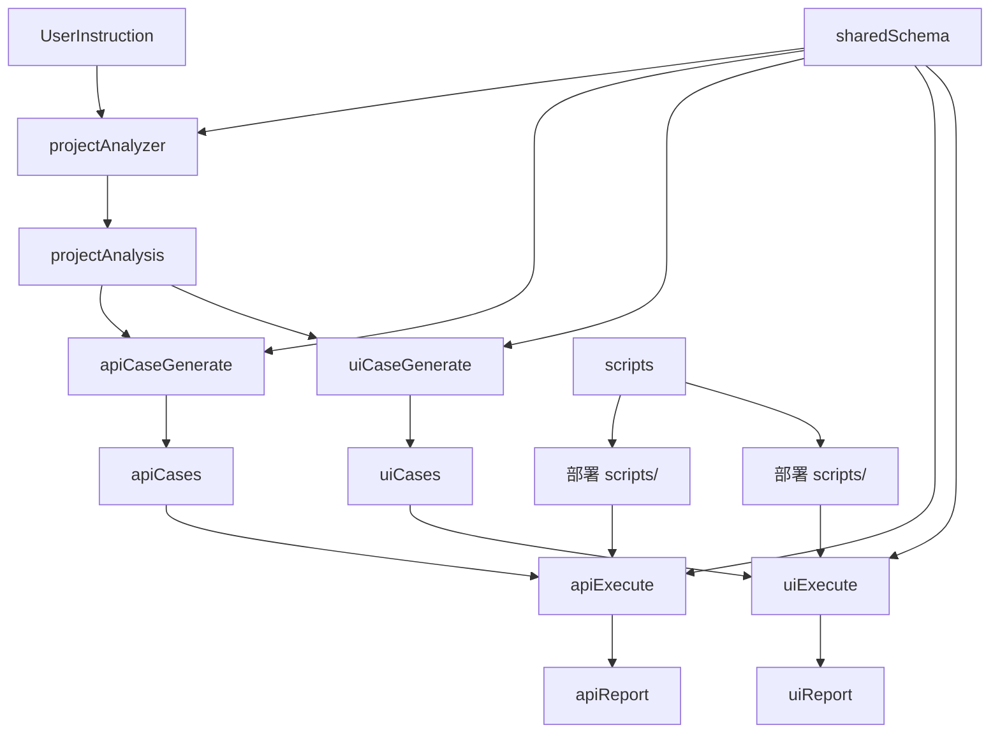

# AI 测试流水线 — 架构与流程

> 验收以**覆盖率与链路完整性**为主，不以用例条数为 KPI。

## 总览



## 阶段划分

| 阶段 | 技能目录 | 产物 |
|------|----------|------|
| 分析 | `project-analyzer/` | `project-analysis-{ts}.json` |
| API 生成 | `api-test-case-generate/` | `api-cases/api-cases-{ts}.json` |
| UI 生成 | `ui-test-case-generate/` | `ui-cases/ui-cases-{ts}.json` |
| 脚本部署 | `api-test-execute/` / `ui-test-execute/` 步骤 0 | `ai-tests/scripts/*.mjs` + `ui-test.config.json` 按需部署到目标项目 |
| API 执行 | `api-test-execute/` + `ai-tests/scripts/run-api-tests.mjs` | `ai-tests/test-artifacts/api-reports/api-report-{ts}.md` |
| UI 执行 | `ui-test-execute/` + `ai-tests/scripts/run-ui-tests.mjs` | `ai-tests/test-artifacts/ui-reports/ui-report-{ts}.md` |

说明：脚本部署是执行阶段的步骤 0，从技能包 `scripts/` 复制到目标项目，文件已存在则跳过。

## 链路字段

所有用例统一使用 `trace` 对象：

- `trace.flowRefs` — 主流程 id（`FLOW-*`）
- `trace.dependsOn` — 上游用例 id
- `trace.produces` / `trace.consumes` — 变量产出与消费

## 执行入口

**所有命令在目标项目根目录执行**（该目录下应有 `ai-tests/`）：

```bash
cd d:\IdeaProjects\WMS
node ai-tests/scripts/validate-artifacts.mjs
node ai-tests/scripts/run-api-tests.mjs --base-url <地址>
node ai-tests/scripts/run-ui-tests.mjs --base-url <地址>
```

## 验收口径

- 主流程覆盖率 `mainFlowCoveragePercent = 100%`
- `orphanCases = 0`
- 链路可执行（依赖与变量消费可解析）
- 执行成功产出 Markdown 报告
