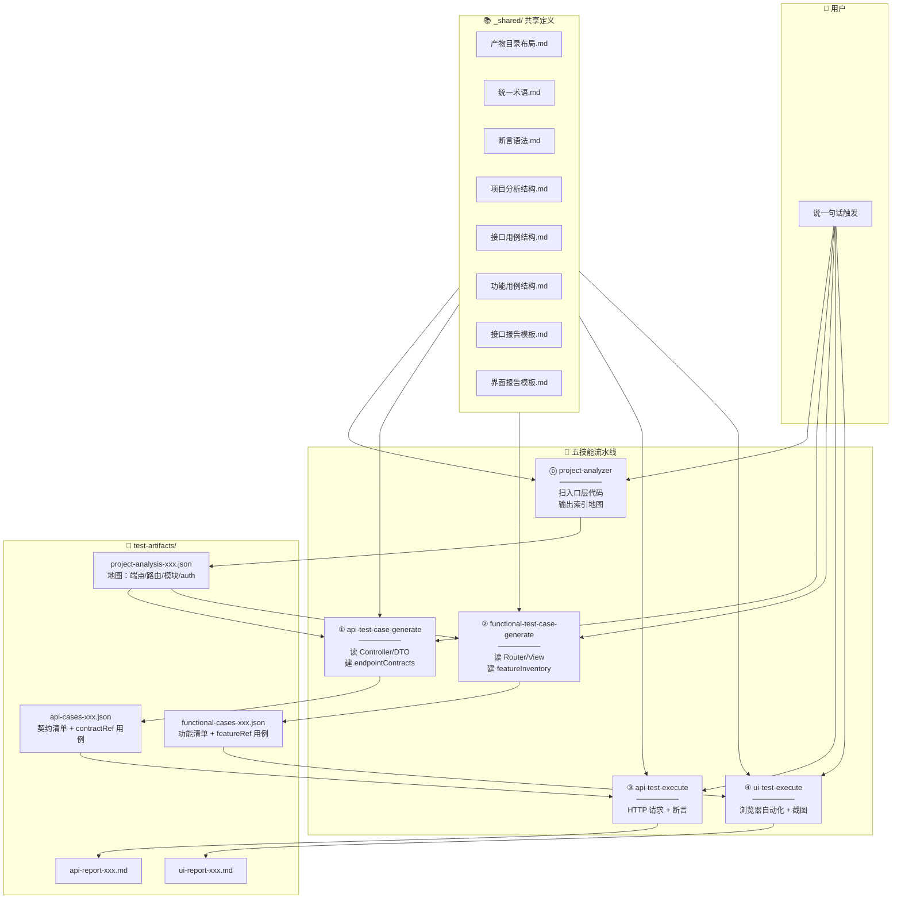
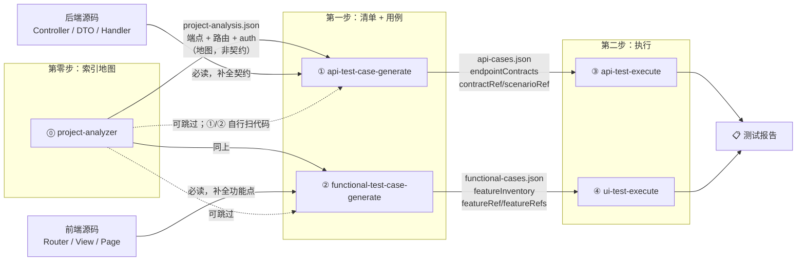
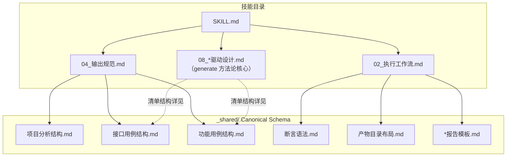
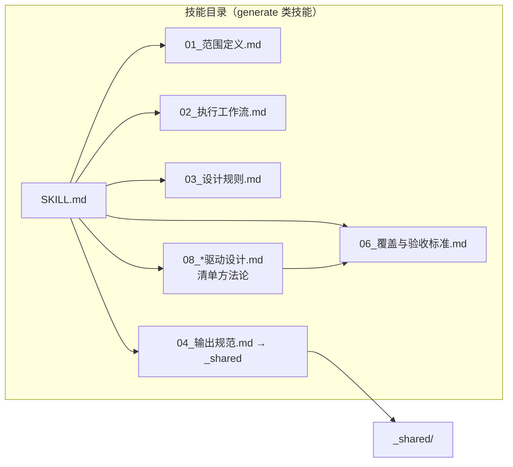
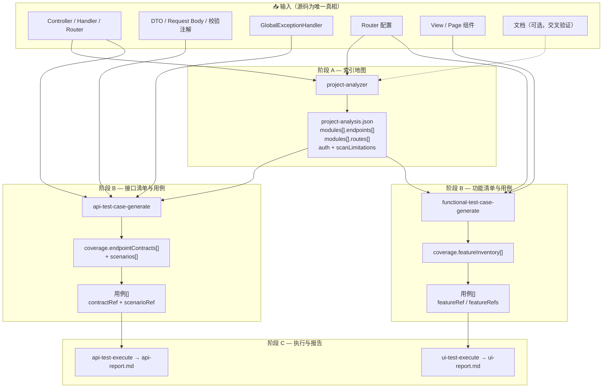
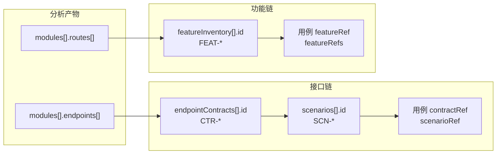

# AI 测试流水线 — 架构与流程图

> 本文描述 `ai-test-pipeline` 五技能的依赖关系与**数据流**。  
> Schema 以 `_shared/` 为唯一来源；验收看**覆盖率**，不看用例条数 KPI。

---

## 一、目标架构图



### 各技能产出要点

| 技能 | 读什么 | 写什么 | 验收 |
|------|--------|--------|------|
| ⓪ project-analyzer | Controller、Router（入口层） | `project-analysis.json` | 端点/路由索引完整；含 `scanLimitations` |
| ① api-test-case-generate | analysis + **DTO/异常处理** | `api-cases.json` + `coverage.endpointContracts` | P0 契约场景 **100%**（`contractScenarioCoveragePercent`） |
| ② functional-test-case-generate | analysis + **View/组件** | `functional-cases.json` + `coverage.featureInventory` | P0 功能点 **100%**（`featureCoveragePercent`） |
| ③ api-test-execute | `api-cases.json` | `api-report.md` | 断言通过/失败明细 |
| ④ ui-test-execute | `functional-cases.json` | `ui-report.md` + 截图 | 断言通过/失败 + 截图 |

---

## 二、技能依赖图



**说明**：

- `project-analysis` 是**加速器**，不是唯一输入；generate 技能**必须读源码**补全清单。
- 接口用例与功能用例**并行、互补**，数量无需对齐。
- 跳过 ⓪ 时，①/② 自行分析代码，但仍须产出 `endpointContracts` / `featureInventory`。

---

## 三、文件引用关系图



| 技能 | 主要引用 _shared |
|------|------------------|
| project-analyzer | `项目分析结构.md`、`产物目录布局.md` |
| api-test-case-generate | `接口用例结构.md`、`断言语法.md` |
| functional-test-case-generate | `功能用例结构.md`、`断言语法.md` |
| api-test-execute | `接口用例结构.md`、`接口报告模板.md` |
| ui-test-execute | `功能用例结构.md`、`界面报告模板.md` |

---

## 四、单个技能内部文件结构



---

## 五、数据流全景（三阶段）



### 阶段 A：索引地图（project-analysis）

| 写入字段 | 可信度 | 下游用途 |
|----------|--------|----------|
| `endpoints[].method/path` | 高 | 定位 Controller，建 `endpointContracts` |
| `endpoints[].requestBody` | 低 | **须读 DTO 核实** |
| `routes[].path/component` | 高 | 打开 View，建 `featureInventory` |
| `auth` | 中–高 | 登录前置、token 格式 |
| `scanLimitations` | — | 提醒勿把 analysis 当完整契约 |

### 阶段 B：清单 + 用例（generate）

**接口侧**

1. 对每个端点读 Controller + DTO → 写入 `coverage.endpointContracts[]`
2. 为每个契约场景（`scenarios[]`）写 1 条用例，绑定 `contractRef` + `scenarioRef`
3. 元信息统计 `contractScenarioCoveragePercent`，目标 **100%**

**功能侧**

1. 对每个路由打开 View → 写入 `coverage.featureInventory[]`
2. 为每个 P0 功能点写用例，绑定 `featureRef`（流程用例用 `featureRefs[]`）
3. 元信息统计 `featureCoveragePercent`，目标 **100%**

**禁止**：模板轮换凑数、`totalCases ≥ 2.5N` / `≥ 70` 等条数 KPI。

### 阶段 C：执行（execute）

- 读取 JSON 用例数组（跳过首元素 meta）
- 接口：变量替换 → HTTP → 断言（`断言语法.md`）
- UI：steps → 断言 → 截图
- 报告展示执行结果 + meta 中的覆盖率指标

---

## 六、产物字段追溯链



| 层级 | 接口 | 功能 |
|------|------|------|
| 地图 | `endpoints[]` | `routes[]` |
| 清单 | `endpointContracts` + `scenarios` | `featureInventory` |
| 用例追溯 | `contractRef` + `scenarioRef` | `featureRef` / `featureRefs` |
| 验收指标 | `contractScenarioCoveragePercent` | `featureCoveragePercent` |

---

## 七、latest 指针与文件命名

```
test-artifacts/
├── project-analysis-{yyyyMMdd-HHmmss}.json
├── api-cases/api-cases-{yyyyMMdd-HHmmss}.json
├── functional-cases/functional-cases-{yyyyMMdd-HHmmss}.json
├── api-reports/api-report-{yyyyMMdd-HHmmss}.md
├── ui-reports/ui-report-{yyyyMMdd-HHmmss}.md
└── latest    ← 内容为最新时间戳字符串
```

每次生成新产物后更新 `latest`；下游技能优先读指针定位最新文件。详见 `产物目录布局.md`。

---

## 八、与 git-api-test-skill-pack 的关系

| 维度 | ai-test-pipeline（本包） | git-api-test-skill-pack（仓库内） |
|------|--------------------------|-----------------------------------|
| 范围 | 分析 → 接口+功能用例 → 双执行 | Git 变更驱动 → 接口测试为主 |
| 入口 | project-analyzer | Git diff / 提交记录 |
| 用例方法 | 契约/功能清单驱动 | RestAssured + Allure 流水线 |
| 适用 | 通用五技能流水线 | 本仓库 CI/变更回归场景 |

二者可独立使用；同一项目可同时保留，但**不要混用**旧模板脚本（如 `generate_test_cases.py`）与新清单驱动 Agent 工作流。
