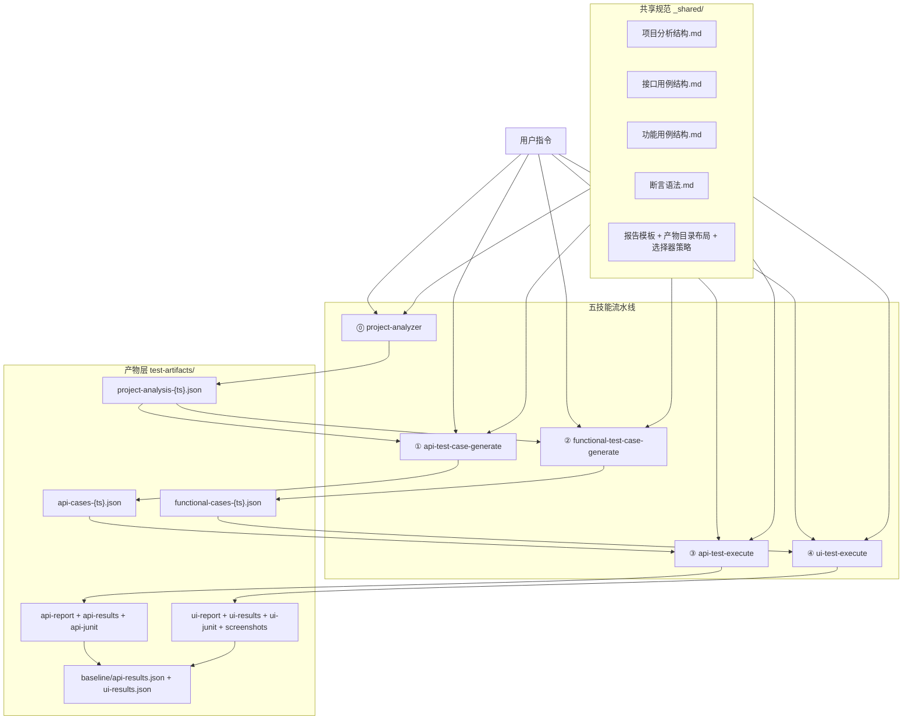
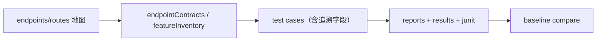

# AI 测试流水线 — 架构与流程

> 本文按仓库当前真实状态描述 `ai-test-pipeline` 的技能关系、数据流与产物流。  
> 验收以**覆盖率与链路完整性**为主，不以用例条数为 KPI。

---

## 一、总览架构



---

## 二、阶段划分

### 阶段 A：索引地图（project-analysis）

- 输入：后端入口（Controller/Router）、前端路由配置、认证配置
- 输出：`project-analysis-{ts}.json`
- 定位：提供端点/路由索引与链路线索（`chainHints`），不是最终契约真相

### 阶段 B：清单 + 用例生成

- API 侧：
  - 生成 `coverage.endpointContracts`
  - 为契约场景生成可追溯用例（`contractRef/scenarioRef`）
- 功能侧：
  - 生成 `coverage.featureInventory`
  - 为功能点生成可追溯用例（`featureRef/featureRefs`）
- 双侧都要求链路字段可落地：
  - `dependsOnCases`、`produces`、`consumes`
  - UI 还可用 `steps.saveAs/useVar`

### 阶段 C：确定性执行 + 报告

- API 执行器：`scripts/run-api-tests.mjs`
  - 产物：`api-report-{ts}.md` + `api-results-{ts}.json` + `api-junit-{ts}.xml`
- UI 执行器：`scripts/run-functional-tests.mjs`
  - 产物：`ui-report-{ts}.md` + `ui-results-{ts}.json` + `ui-junit-{ts}.xml` + 截图
- 回归对比：`scripts/compare-results.mjs`
  - 基线：`test-artifacts/baseline/`

---

## 三、执行控制面

### 1) 机检门禁

- `scripts/validate-api-cases.mjs`
- `scripts/validate-functional-cases.mjs`

推荐参数：

- `--strict`
- `--enforce-chain`

### 2) 执行入口

- API：`node scripts/run-api-tests.mjs`
- UI：`node scripts/run-functional-tests.mjs`

### 3) 回归入口

- 建基线：`node scripts/compare-results.mjs --update-baseline`
- 回归门禁：`node scripts/compare-results.mjs --fail-on-regression`

### 4) npm 快捷入口

- `npm run validate`
- `npm run test:api`
- `npm run test:ui`
- `npm run baseline`
- `npm run compare`
- `npm run compare:ci`

---

## 四、路径约定（当前仓库）

```text
ai-test-pipeline/
├── scripts/                  # 机检/执行/回归脚本
├── test-artifacts/           # 全部产物根目录（运行时生成）
│   ├── api-cases/
│   ├── functional-cases/
│   ├── api-reports/
│   ├── ui-reports/
│   ├── baseline/
│   └── latest
└── _shared/                  # 结构与术语规范
```

约定：

- 默认从当前工作目录解析 `./test-artifacts`
- 可用 `--artifacts-dir <dir>` 覆盖
- 在包含 `test-artifacts/` 的目录执行脚本，**不要 `cd test-artifacts`**

---

## 五、追溯链（数据视角）



接口追溯：

- `contractRef` + `scenarioRef` → `coverage.endpointContracts[].scenarios[]`

功能追溯：

- `featureRef` / `featureRefs` → `coverage.featureInventory[]`

链路追溯（双侧通用）：

- `dependsOnCases`
- `produces`
- `consumes`

---

## 六、验收口径（统一）

- P0 契约场景覆盖率 / P0 功能点覆盖率 = 100%
- `orphanCases = 0`（流程用例需显式标注追溯）
- 链路可执行（依赖与变量消费可解析）
- 执行产物齐全（报告 + 机读结果 + JUnit 报告）
- 回归对比可运行（baseline 可建、可比、可门禁）

---

## 七、当前边界说明

- 本仓库当前按本地运行维护，不内置 GitHub Actions 工作流文件。
- 自动化门禁可通过本地/CI 调用 `scripts/*.mjs` 自行接入。
- UI 执行依赖 Playwright（`package.json` 为 optionalDependencies）。

